## Green Tax Formula and Proof of Concept for Hotel Absorption

> **Created by**: Mohamed Shaif Hassan  
> **Designation**: Product Manager  
> **Date**: 9th December 2024

---

## Current Setup

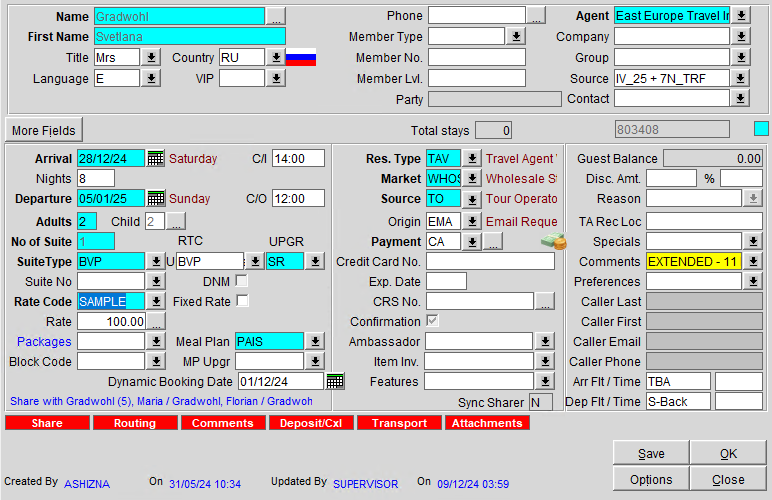

A sample reservation is created from **28th December 2024** to **5th January 2025** for 2 adults and 2 children, with an all-inclusive rate of `$100` (inclusive of taxes and service charges), including a `$6` per person Green Tax as per the current configuration.

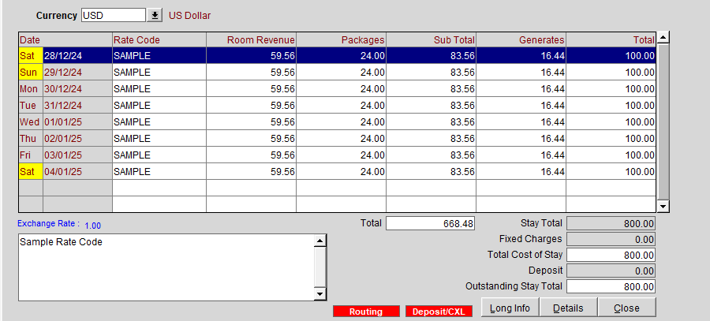

- A total of `$24` Green Tax is calculated for each date based on the current configuration.
- This amount is calculated from the default Green Tax package attached to the reservation.

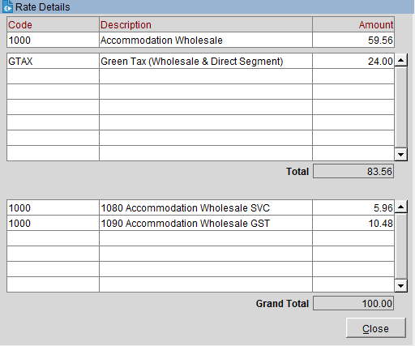

> **Note**: The total Green Tax amount calculated for the reservation is `$192` for 8 days.

---

## Green Tax Formula

A new formula is created to calculate Green Tax dynamically within package configurations:

```plsql
 generate_gtax(
  in_resv_name_id IN NUMBER,
  in_amount_to_post IN NUMBER,
  in_mode IN CHAR DEFAULT 'N', -- 'N' = Not Required, 'B' = Booking Date, 'A' = Arrival Date (optional)
  in_operator IN CHAR DEFAULT 'N', -- '<' = Less than, '>' = Greater than, '=' = Equal (optional)
  in_considered_date IN DATE DEFAULT NULL -- Optional
);

-- Example usage:
greentax(RESV_NAME_ID, 6)
greentax(RESV_NAME_ID, 6, 'B', '>', TO_DATE('2024-12-10', 'YYYY-MM-DD'));
```

### Parameters

- **`in_resv_name_id`**: Reservation ID dynamically assigned when the formula is used in a package configuration.
- **`in_amount_to_post`**: The per-person amount to be calculated. For example, `$6` per person as shown above.
- **`in_mode`**: Optional parameter to define the calculation mode:
  - `N`: No conditions (default Green Tax calculation).
  - `B`: Compare against the Booking Date.
  - `A`: Compare against the Arrival Date.
- **`in_operator`**: Optional parameter to define the comparison operator:
  - `=`: Equal to the considered date.
  - `<`: Less than the considered date.
  - `>`: Greater than the considered date.
- **`in_considered_date`**: The user-defined date for comparison.

---

## Package Configuration

### Package 1: Additional Green Tax Calculation

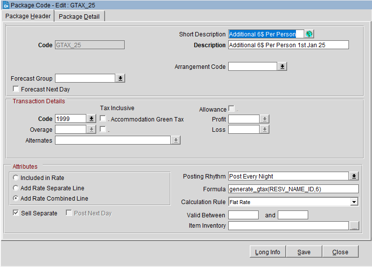

A new package is created to calculate an additional `$6` Green Tax per person as per government requirements. This amount is:

- Calculated as a fixed rate.
- Added as a combined line item.

```plsql
generate_gtax(RESV_NAME_ID, 6)
```

> **Result**: From **1st January 2025**, an additional `$6` per person per day is applied, resulting in a total of `$12` per person per day.

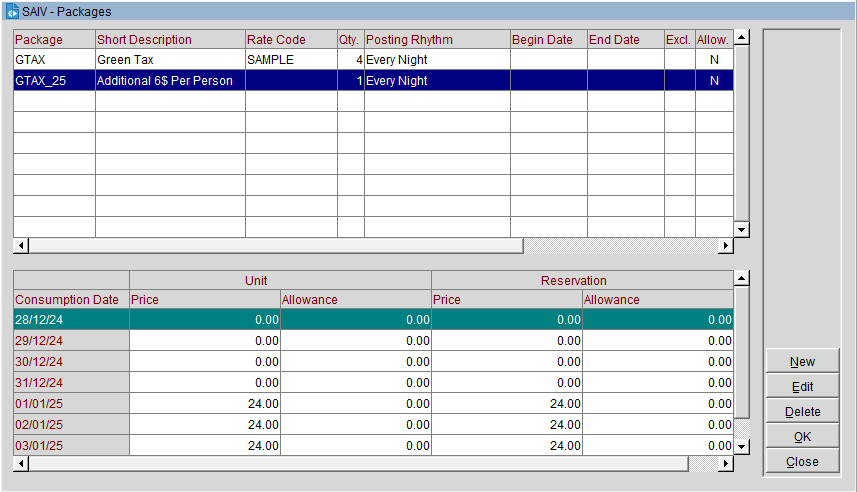

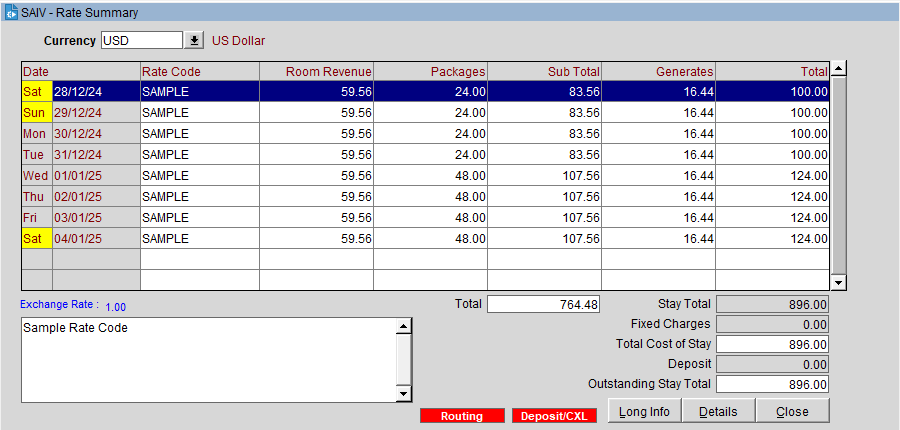

- From **28th to 31st December**, only the default Green Tax of `$6` per person is applied.
- From **1st January 2025**, the total Green Tax is `$48` ($24 from the default package + $24 from the new package).

---

### Package 2: Green Tax Absorption and Rebate

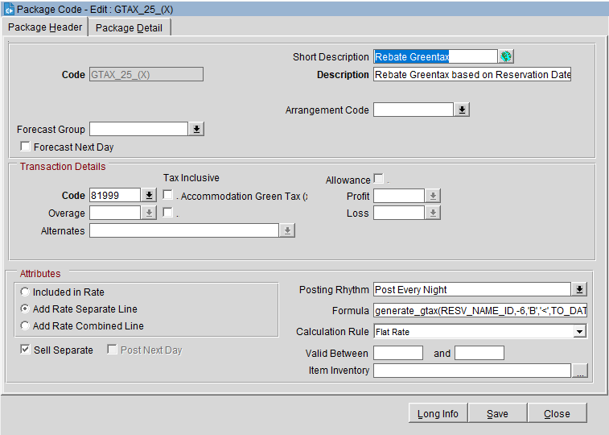

A second package is created to rebate the additional `$6` Green Tax for bookings made before **10th December 2024**. This:

- Posts a negative `$6` per person per day.
- Can be combined with the initial Green Tax package.

```plsql
generate_gtax(RESV_NAME_ID, -6, 'B', '<', TO_DATE('2024-12-10', 'YYYY-MM-DD'))
```

> **Result**: The additional `$6` Green Tax is absorbed by the hotel for eligible bookings.

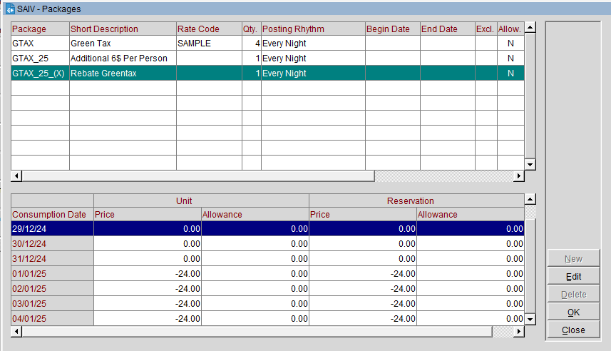

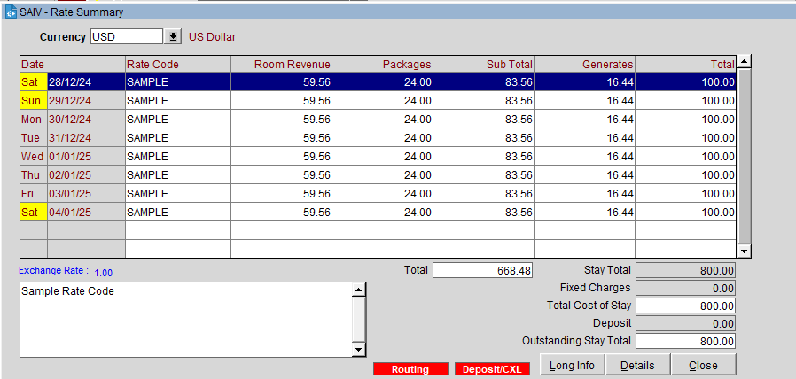

- The rebate restores the total Green Tax amount to `$6` per person per day.
- From **1st January 2025**, the final breakdown is:
  - `$24` from the default package.
  - `$24` from the new package.
  - `-$24` from the rebate package.

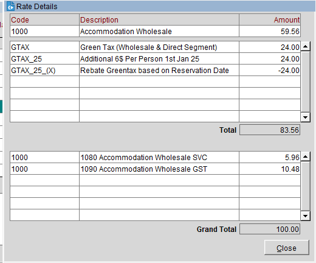

---

## Testing Dynamic Booking Dates

For testing, a dynamic field is added to manually adjust the booking date.

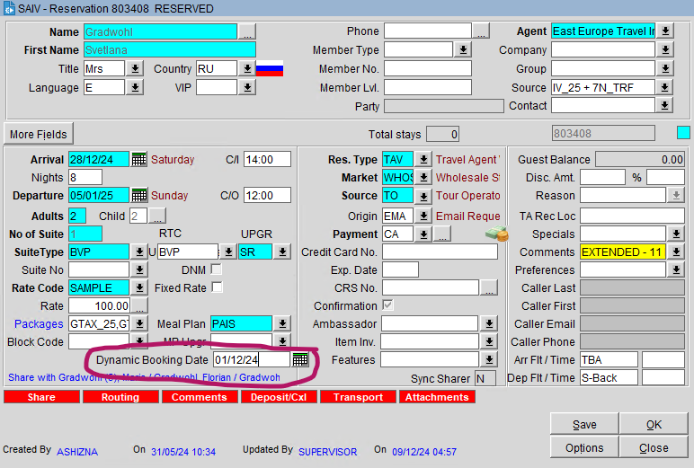

Changing the booking date to **10th December 2024** shows:

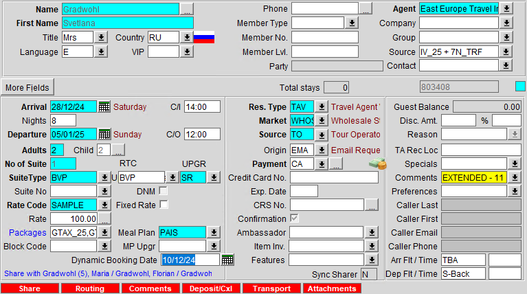

- No additional rebate is applied as the booking date is not earlier than **10th December**.

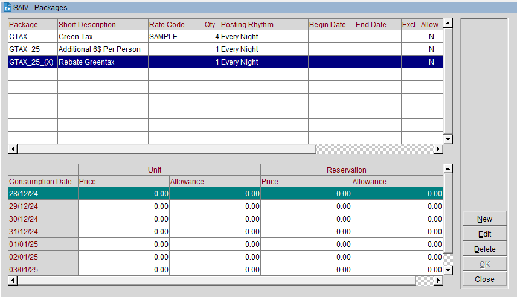

- 
- The rate information reflects a `$24` Green Tax increment from **1st January 2025**.

---

## Conclusion

This setup ensures:

1. Compliance with the Green Tax increment regulations effective **1st January 2025**.
2. Flexibility to absorb the additional tax for bookings made before **10th December 2024**.
3. Dynamic testing capabilities to validate different scenarios.

For further assistance or customizations, please contact our support team.
